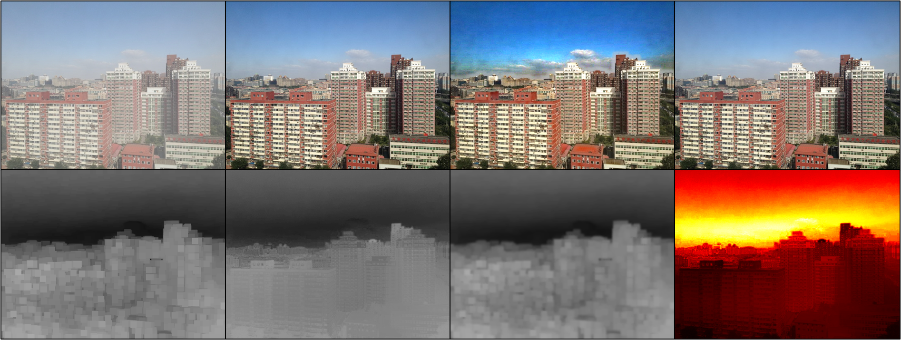

# dehaze-dcp

## Result:

## Introduction
- La liste des projets pour IMA201 est disponible ici :
https://perso.telecom-paristech.fr/gousseau/IMA201/projets2023.html

- Les instructions (merci de les lire attentivement) sont ici :
https://perso.telecom-paristech.fr/gousseau/IMA201/projets.html

## References:
- [Single Image Haze Removal](https://kaiminghe.github.io/cvpr09/index.html)
- [Single Image Haze Removal Using Dark Channel Prior](https://kaiminghe.github.io/publications/cvpr09.pdf)

**paper:**
1. [Single Image Haze Removal using Dark Channel Prior(CVPR 2009)](https://kaiminghe.github.io/publications/cvpr09.pdf)
2. [Guided Image Filtering(ECCV 2010))](https://kaiminghe.github.io/publications/eccv10guidedfilter.pdf)
3. [Single Image Haze Removal using Dark Channel Prior(TPAMI 2011)](https://kaiminghe.github.io/publications/pami10dehaze.pdf)
4. [Guided Image Filtering(TPAMI 2013)](https://kaiminghe.github.io/publications/pami12guidedfilter.pdf)
5. [A review on dark channel prior based image dehazing algorithms](https://jivp-eurasipjournals.springeropen.com/counter/pdf/10.1186/s13640-016-0104-y.pdf)
6. 

**slides of author**
- [CVPR 2009 presentation slides](https://kaiminghe.github.io/cvpr09/cvpr09slides.pdf)
- [ECCV 2010 presentation slides](https://kaiminghe.github.io/cvpr09/eccv10ppt.pdf)

## Principle
### Dark Channel Prior
