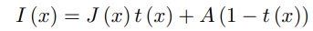

# dehaze-dcp

[latex](https://www.overleaf.com/project/65270c10e561c1ac3575d059)
## TODO
1. eq15中lambda的作用
2. 算dark_channel时 patch size 大小影响
3. guided filter是否必须转换为灰度图
4. 两个算法时间比较, 考虑laplace 解方程优化算法(更快的算法)
5. 使用更多图片
6. 参考benchmark

### tmp

**Introduction**

- 针对本项目的简介: 用什么算法解决什么问题 + 项目要求(代码复现) 
- 针对于去雾任务的调研, 简短: 多图 -> 单图 -> AI -> 应用(自动驾驶)

**已完成**

- 大气模型 (classical description for hazy image generation)	

  

- DCP 

- 深度图

- 优化t map

- 程序复现效果 [github] 定性的一组图片 + 定量的表格

**未完成**

